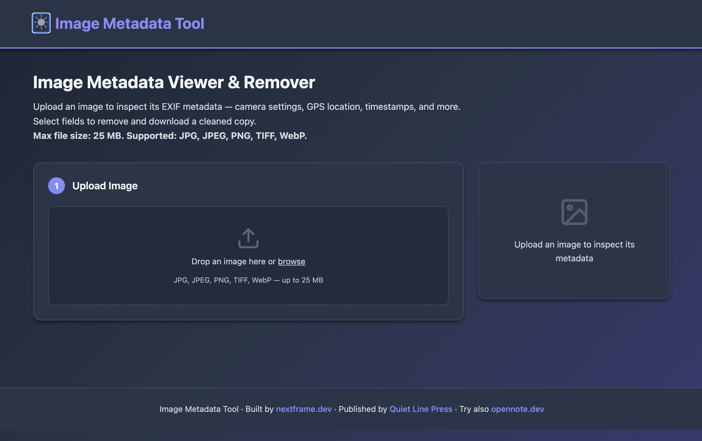

# Image Metadata Tool

A self-hosted web app to view and selectively remove EXIF metadata from images. Inspect camera settings, GPS location, timestamps, and more — then strip what you don't want and download a cleaned copy.




## Features

- **EXIF metadata viewer** — grouped by IFD: Image, Exif, GPS, Thumbnail, Interoperability
- **GPS location decoding** — see lat/lon in decimal degrees
- **Sensitive field highlighting** — GPS, timestamps, artist, and copyright fields are flagged
- **Selective removal** — check individual tags or entire groups to strip
- **Bulk actions** — Select All, Select None, Select Sensitive
- **Multiple formats** — JPG, JPEG, PNG, TIFF, WebP (up to 25 MB)
- **Download cleaned copy** — original file is never modified
- **Dark / Light theme** — toggles automatically based on system preference
- **Server-side validation** — file type, size, and content checks

## Quick Start

```bash
git clone https://github.com/nextframedev/image-metadata-tool.git
cd image-metadata-tool
bash start.sh
```

The app will:
1. Create a Python virtual environment
2. Install dependencies
3. Start the server at **http://localhost:5051**

## Manual Setup

```bash
python3 -m venv venv
source venv/bin/activate
pip install -r requirements.txt
python3 app.py
```

## Usage

1. Open **http://localhost:5051** in your browser
2. **Upload an image** — drag-and-drop or click to browse (JPG, JPEG, PNG, TIFF, WebP)
3. **Inspect metadata** — view all EXIF fields grouped by category, with sensitive fields highlighted
4. **Select fields to remove** (optional):
   - **Select Sensitive** — auto-select GPS, timestamps, artist, copyright
   - **Select All / None** — bulk toggle
   - Or check individual tags and groups
5. Click **Remove Selected Metadata**
6. **Download** the cleaned image

## Configuration

| Setting | Default | Description |
|---------|---------|-------------|
| Port | `5051` | `PORT` env var |
| Debug mode | `false` | `FLASK_DEBUG` env var |
| Secret key | (random) | `SECRET_KEY` env var |
| Bind address | `127.0.0.1` | `HOST` env var |
| Max file size | 25 MB | — |

## Project Structure

```
├── app.py              # Flask application
├── start.sh            # Startup script (venv + install + run)
├── requirements.txt    # Python dependencies
├── templates/
│   └── index.html      # Main page template
├── static/
│   └── css/
│       └── style.css   # Stylesheet (light/dark themes)
└── uploads/            # User uploads (created at runtime)
```

## Requirements

- Python 3.10+
- Dependencies (installed automatically via `start.sh`):
  - Flask >= 3.0.0
  - Werkzeug >= 3.0.0
  - Pillow >= 10.0.0
  - piexif >= 1.1.3

## License

MIT — see [LICENSE](LICENSE) for details.

Copyright (c) 2026 [nextframe.dev](https://nextframe.dev)
Authors: Blue J. Lion & Lu Li

## Books by the Authors

<p align="center">
  <a href="https://www.amazon.com/dp/B0GRVLNV2H">
    
  </a>
  <br>
  <em>Scan to check out our books on Amazon</em>
</p>
